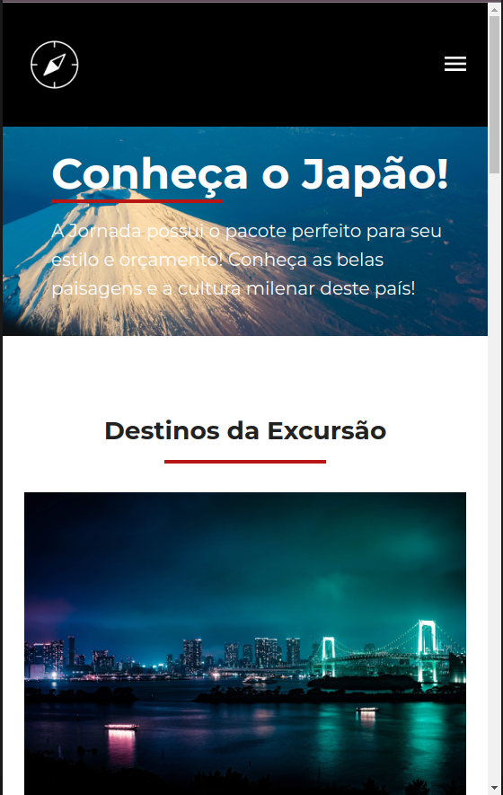
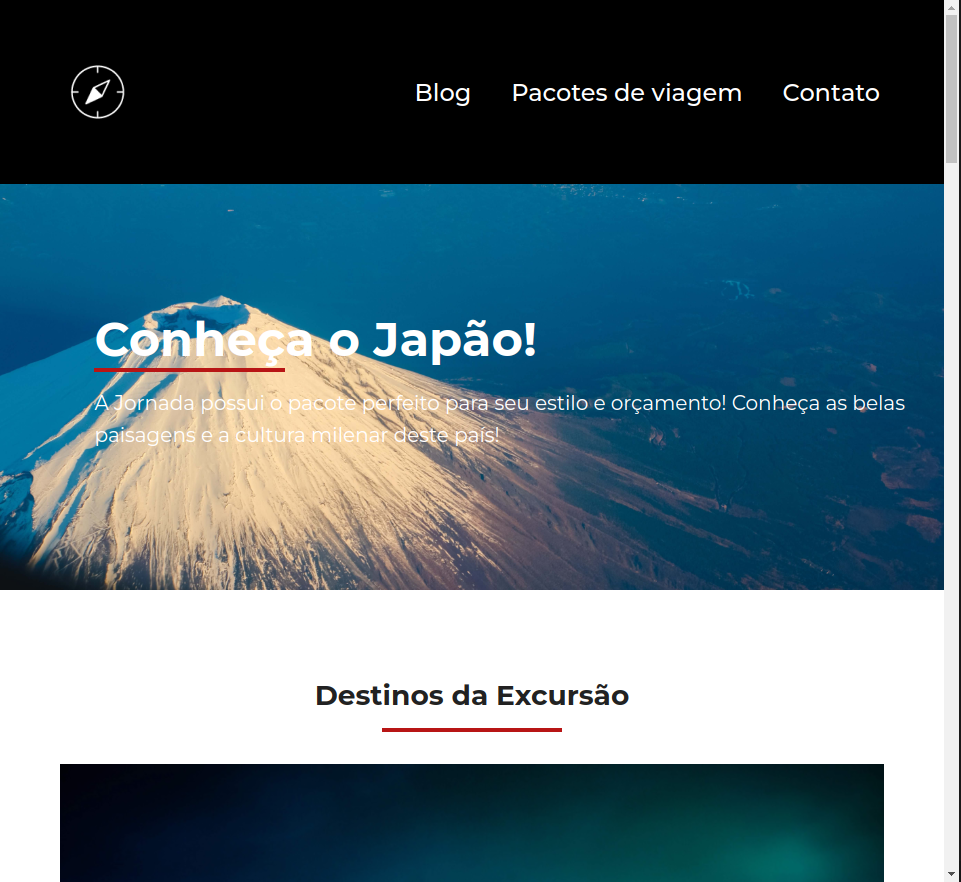
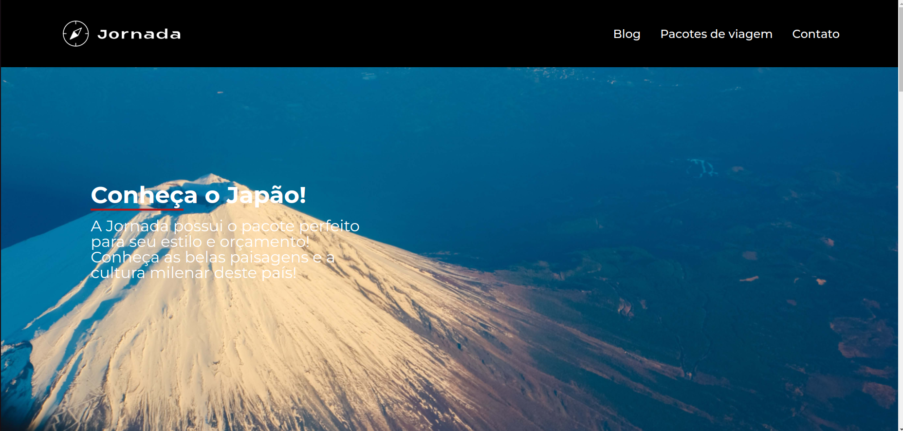

---

# 📱✨ Projeto Responsivo com HTML & CSS 🎨

Bem-vindo(a) ao **meu incrível projeto web**! 🎉 Este projeto foi desenvolvido utilizando **HTML e CSS**, seguindo **boas práticas de acessibilidade e semântica**, com um layout **totalmente responsivo**, adaptando-se perfeitamente a qualquer tamanho de tela – de **smartphones** 📱 a **tablets** e **desktops** 🖥️. Ainda estou ajustando os toques finais em JavaScript para deixá-lo **100% pronto**! 💻🚀

## 💡 Sobre o projeto

Este site foi desenvolvido com a filosofia **mobile-first** 📲, começando com foco total na experiência para **dispositivos móveis** e, em seguida, escalando para **tablets** e **desktops** com **CSS responsivo**. A ideia principal é que **independentemente do dispositivo usado**, o usuário terá uma navegação fluida, acessível e amigável. 🧑‍💻✨

⚙️ **Principais características**:

- 📱 **Design Mobile-First**: Projetado primeiramente para telas menores, garantindo uma experiência incrível para usuários móveis.
- 💻 **Totalmente Responsivo**: Se ajusta perfeitamente a qualquer resolução, adaptando o layout e as fontes com **media queries**.
- 🎨 **Design Clean e Moderno**: Segue as tendências modernas de UI/UX, com um foco em simplicidade e eficiência.
- ♿ **Acessibilidade**: Todos os elementos seguem as melhores práticas para **acessibilidade na web**, como navegação por teclado, descrição de imagens, e uso apropriado de tags HTML semânticas.
- 🌐 **Semântica**: Cada elemento HTML foi cuidadosamente escolhido para melhorar o SEO e a compreensão do conteúdo pelos leitores de tela.
- 🎯 **Performance Otimizada**: O código foi escrito com foco em **eficiência**, garantindo carregamento rápido e fluidez.

## 🛠️ Tecnologias Utilizadas

- **HTML5**: Estrutura semântica robusta e bem definida para garantir uma navegação intuitiva e acessível.
- **CSS3**: Responsividade, animações suaves e estilização adaptativa para diferentes resoluções.
- **Flexbox** e **Grid Layout**: Usados para garantir uma organização de layout fluida em qualquer dispositivo.
- **Media Queries**: Responsividade garantida para todos os tamanhos de tela.

## 🎨 Estilos e Layout

O design do site foi pensado para ser **minimalista** e **elegante**, proporcionando uma experiência visual agradável, sem distrações, com foco no conteúdo.

✨ **Fontes e cores** também se adaptam conforme o tamanho da tela, oferecendo uma experiência consistente em **telas pequenas**, **médias** e **grandes**.

## 🌍 Responsividade (Mobile-First)

1. 📲 **Mobile (320px a 480px)**: Layout otimizado para **smartphones**, com navegação simplificada e botões grandes para facilitar a interação.
2. 💻 **Tablet (481px a 768px)**: Adapta-se automaticamente para telas de tamanho médio, ajustando fontes e espaçamentos.
3. 🖥️ **Desktop (768px ou superior)**: O layout se expande para aproveitar o espaço maior, com ajustes visuais que tornam o site **ainda mais atraente**.

## 🚀 Melhorias Futuros

🔧 O próximo passo será implementar **JavaScript** para adicionar funcionalidades dinâmicas ao site, como interações em formulários, animações customizadas e outras features que enriquecerão ainda mais a experiência do usuário.

## 🔥 Como usar

Para conferir o projeto, basta seguir os passos abaixo:

1. **Clone o repositório**:
   ```bash
   git clone https://github.com/seu-usuario/seu-projeto.git
   ```

2. **Abra o arquivo `index.html`** no navegador de sua preferência.

3. Aproveite a experiência visual e de navegação! 😎

## 📷 Preview

Aqui está um **preview** rápido do layout do projeto em diferentes dispositivos:

### Mobile Preview:


### Tablet Preview:


### Desktop Preview:


## 🎯 Acessibilidade

**Focado na inclusão**, este projeto foi desenvolvido pensando na **experiência para todos os usuários**, independentemente de suas habilidades:

- Uso adequado de tags HTML semânticas para melhorar o SEO e a acessibilidade.
- Textos alternativos para imagens (`alt`) para leitores de tela.
- Contraste de cores que facilita a leitura.
- Navegação por teclado para usuários com limitações motoras.

---

💡 **Nota final**: Este projeto é um exemplo de como é possível desenvolver um site **modernamente responsivo**, **acessível**, e **funcional** usando as tecnologias básicas da web. Espero que você aprecie o resultado tanto quanto eu gostei de desenvolvê-lo! 😊

---
